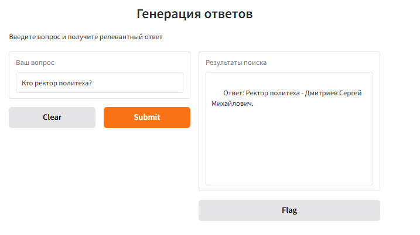

# Student_Assistance_RAG_System
RAG-система, для генерации ответов на вопросы студентов НГТУ им. Алексеева. 

Система помогает студентам быстро находить ответы на вопросы, связанные с учебой. В качестве базы данных используется ["Путеводитель первокурсника" НГТУ им. Алексеева](Putevoditel_pervokursnika_NNTU.pdf).  

Загрузка данных - фрагменты из "Путеводителя первокурсника" обрабатываются и сохраняются.  
Поиск - когда пользователь задает вопрос через графический интерфейс, система находит наиболее релевантные фрагменты текста с помощью семантического поиска.  
Генерация - найденные фрагменты передаются в LLM, которая генерирует ответ на вопрос.  
# Зависимости
Основные библиотеки:  

- [sentence-transformers](https://www.sbert.net/) 
- [openai](https://platform.openai.com/) 
- [faiss-cpu](https://faiss.ai/) 
- [gradio](https://www.gradio.app/)
- [docling](https://github.com/DS4SD/docling)
# Пример использования
**Вопрос студента:**  

"Кто ректор политеха?"  

**Поиск релевантных фрагментов из БД:**
```python
# Пример использования
results = semantic_search("Кто ректор политеха?")
for doc, score in results:
    print(f"Score: {score:.4f} | {doc}")
```
**Результат поиска**
```
Score: 0.4355 | Должность: Помощник ректора (6 корпус),  ФИО: Осьминин Алексей Викторович , Номер телефона: 257-86-13  

Score: 0.4024 | Должность: Ректор,  ФИО: Дмитриев Сергей Михайлович , Номер телефона: 436-23-25  

Score: 0.3858 | Должность: Зам. директора по проектной деятельности (ауд. 1358), Образовательно-научный институт транспортных систем (ИТС), ФИО: Кулагин Александр Леонидович , Номер телефона: 436-63-64  

Score: 0.3800 | Должность: Проректор по управлению имущественным комплексом,  ФИО: Солдаткин Олег Борисович , Номер телефона: 436-93-23 436-18-70  

```
**Отправка фрагментов в LLM и генерация ответа**  
- Пользователь вводит свой вопрос в систему.

- В качестве релевантных фрагментов используются результаты из `semantic_search`.

- Найденные фрагменты текста отправляются вместе с исходным вопросом в LLM.

- LLM, используя предоставленный контекст, формулирует ответ.

  
# Структура проекта  
Проект состоит из трёх этапов, реализованных в отдельных ноутбуках:
Файлы проекта:
- [create_dataset.ipynb](create_dataset.ipynb) - Подготовка данных

    - Обработка и очистка путеводителя

    - Разбиение текста на семантические фрагменты

    - Формирование датасета для обучения

- [retrieval_training.ipynb](retrieval_training.ipynb) - Обучение модели

    - Fine-tuning модели E5 

- [rag_system.ipynb](rag_system.ipynb) - Основной файл, RAG

    - Создание векторного хранилища с помощью FAISS

    - Создание функции семантического поиска

    - Создание промпта и отправка запроса к LLM

    - Создание веб-интерфейса
